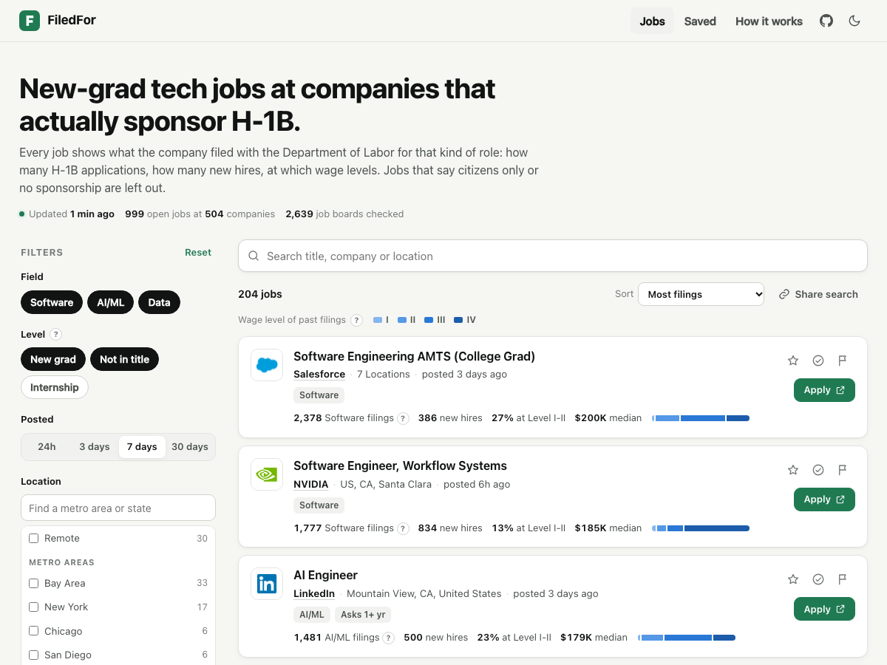

# FiledFor

[](https://github.com/jawaadjariwala/FiledFor/actions/workflows/ci.yml)
[](https://github.com/jawaadjariwala/FiledFor/actions/workflows/poll.yml)
[](LICENSE)

**New-grad tech jobs at companies that have filed H-1B applications for that kind of role.**

**Use it: [filedfor.com](https://filedfor.com/)**. Free, no sign-up, refreshed about every 30 minutes.

[](https://filedfor.com/)

Most "visa-friendly" job lists tell you a company sponsors. FiledFor puts each job next to what the company actually filed with the Department of Labor for that kind of role: how many H-1B applications, how many were new hires, what share sat at the lower wage levels where new grads land, and the median wage. Postings that say citizens only, no sponsorship, or need a security clearance are left out, so every job listed is one you can apply to on a visa.

## Use it

- **Browse** the [site](https://filedfor.com/). Filter by field (Software, AI/ML, Data), level, posting age, metro area or state, or search by title, company or location. Every search is a link you can share.
- **Open any company** to see its filing record for each field, its wage-level mix, new-hire share, median wage and all its open roles.
- **Keep track** with saved and applied jobs and a "new since your last visit" count. All of it stays in your browser; there's no account.
- **Follow an RSS feed** for new jobs: [all fields](https://filedfor.com/feeds/all.xml), [software](https://filedfor.com/feeds/swe.xml), [AI/ML](https://filedfor.com/feeds/ai.xml), [data](https://filedfor.com/feeds/data.xml). Works in any feed reader, and in Slack or Discord through an RSS bot.
- **Use the data.** [`jobs.json`](https://filedfor.com/jobs.json) has every listed job with its evidence, and [`health.json`](https://filedfor.com/health.json) shows the last run. The sponsor tables are in [`data/`](docs/data.md).

## How it works

```
DOL H-1B filings ──> sponsor tables (Parquet) ───────────────┐
                                                             ├──> poller ──> Postgres ──> site, jobs.json, RSS
Greenhouse, Lever, Ashby, Workday, SmartRecruiters boards ───┘   (every 30 min, GitHub Actions)  (GitHub Pages)
```

1. **Sponsor data** (`lca.py`, `sponsors.py`). Every H-1B Labor Condition Application certified from October 2024 to June 2026, about a million rows, reduced to counts per employer, occupation and wage level. [Data notes](docs/data.md).
2. **Watchlist** (`watchlist.py`). About 2,600 company job boards, each matched to the employer's federal tax ID (FEIN) in the DOL data. Matching uses tiered rules and a reviewed queue rather than fuzzy scores, because a wrong match puts false evidence next to a job. [ADR-001](docs/decisions.md#adr-001-matching-job-feed-companies-to-dol-employers).
3. **Poller** (`poll.py`, `feeds.py`). Reads every board through its public JSON API, keeps US tech roles that aren't clearly senior, reads each new description for the years of experience asked and for language that rules out sponsorship, attaches the evidence, and stores what changed. [ADR-002](docs/decisions.md#adr-002-the-poller). Workday boards are large and paged, so they're read newest first. [ADR-003](docs/decisions.md#adr-003-workday-and-smartrecruiters).
4. **Classifier** (`classify.py`). Rules, scored against hand-labelled titles and descriptions with `python -m filedfor.evaluate`. [Scores and known misses](docs/decisions.md#classifier-results-2026-10-01).
5. **Publish** (`publish.py`). Writes the static site (`site/`), `jobs.json`, `health.json` and the RSS feeds for GitHub Pages.

## Limits

- **Filings are history, not a promise.** A company that filed for software engineers before may not sponsor this particular role. Check the posting and ask the recruiter. Nothing here is legal advice.
- **Not every company is covered.** Only boards on the five systems above, found through the SimplifyJobs listings. Oracle and iCIMS are next.
- **Some companies file under a different legal name.** "No filings found" can mean the match missed, not that the company never sponsors.
- **The flags come from rules**, which get most jobs right and some wrong. They err toward leaving a job out.
- **Workday jobs close late.** New Workday jobs appear within 30 minutes, but a closed one can stay listed for up to about 12 hours.
- **Wage level is the prevailing wage level on the filing.** The FY2027 lottery weights by the level the offered wage reaches, which can be higher.

## Run it yourself

You need Python 3.13 and [uv](https://docs.astral.sh/uv/).

```sh
git clone https://github.com/jawaadjariwala/FiledFor.git && cd FiledFor
uv sync
uv run pytest
```

The poller needs a Postgres database (a free [Neon](https://neon.tech) project works):

```sh
echo "DATABASE_URL='postgresql://...'" > .env
uv run python -m filedfor.poll --no-alerts   # writes public/
python -m http.server -d public              # open http://localhost:8000
uv run python -m filedfor.poll --publish-only  # rebuild public/ from the database, e.g. after editing site/
```

The first run records every open job without alerting. Workday boards are read in full 60 at a time; `--workday-full 2000` reads all of them in the first run instead (about 10 minutes).

**To host your own copy:** fork the repo, add `DATABASE_URL` as an Actions secret, set Settings, Pages, Source to "GitHub Actions", and run the Poll workflow once. Add a `DISCORD_WEBHOOK` secret for Discord alerts on new matches.

**To rebuild the sponsor data:** download the LCA disclosure files from the [DOL performance data page](https://www.dol.gov/agencies/eta/foreign-labor/performance) into `data/raw/`, then:

```sh
uv run python -m filedfor.lca        # Excel to Parquet
uv run python -m filedfor.sponsors   # sponsor tables
uv run python -m filedfor.watchlist  # match boards to employers, probe each board
```

## Project layout

```
src/filedfor/
  lca.py, sponsors.py   DOL files to sponsor tables
  watchlist.py          find boards, match them to employers, probe them
  feeds.py              one adapter per job system
  classify.py           field, level, location and sponsorship rules
  evidence.py           filing record for a job's company and field
  diff.py, store.py     what changed since the last run, Postgres
  poll.py               one run, start to finish
  publish.py, notify.py site, jobs.json, companies.json, RSS, Discord
  logos.py              save company logos into site/logos (run by hand)
  evaluate.py           score the classifier against hand labels
site/                   the static page (HTML, CSS, JS; no build step)
data/                   sponsor tables, watchlist, hand-made decisions and labels
docs/                   design decisions and data notes
tests/                  unit tests on saved, trimmed API responses
```

## Documentation

- [Design decisions](docs/decisions.md): matching, the poller, Workday, each with the options considered
- [Data notes](docs/data.md): sources, cleaning rules and quirks
- [Roadmap](ROADMAP.md)

## Contributing

Issues and pull requests are welcome, especially:

- a company FiledFor matched to the wrong employer, or missed (add it to `data/aliases.csv`)
- a job that's listed but shouldn't be, or the other way round (the flag on each job opens a pre-filled report)
- adapters for more job systems

Run `uv run ruff check src tests`, `uv run ruff format src tests` and `uv run pytest` before opening a pull request. CI runs the same.

## Credits and license

H-1B data is public and comes from the U.S. Department of Labor. Company job boards were found through the [SimplifyJobs](https://github.com/SimplifyJobs) listings, which are used only to discover boards and are never republished. Company logos belong to their companies and are shown only to identify them.

Code under the [MIT License](LICENSE).
